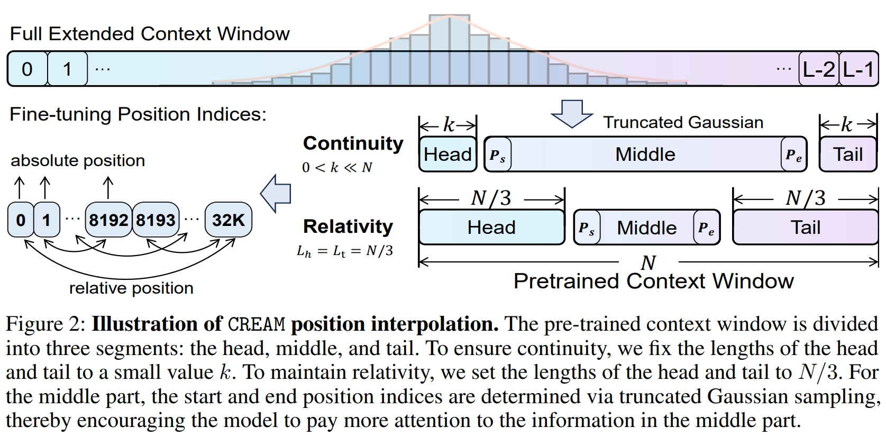
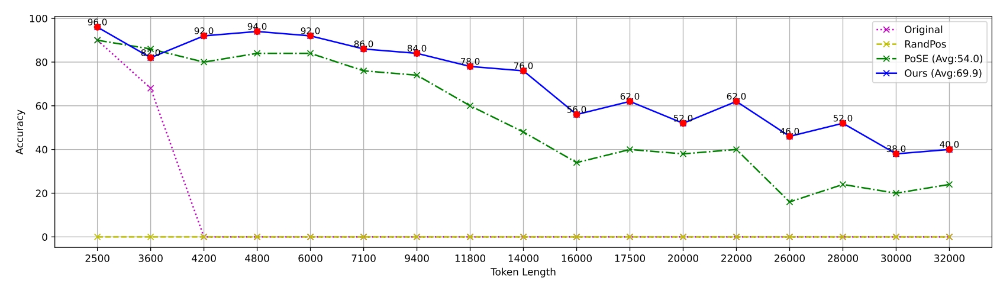
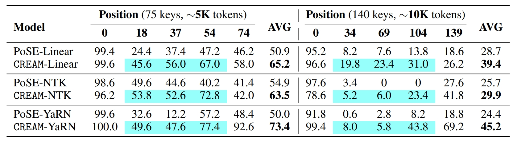
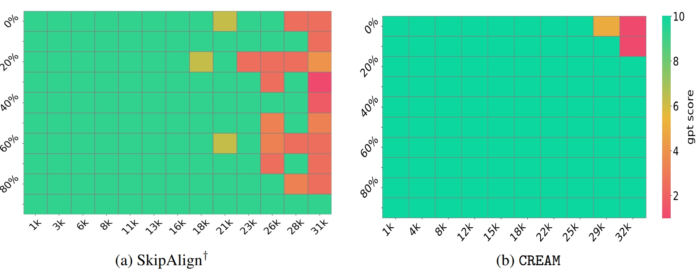
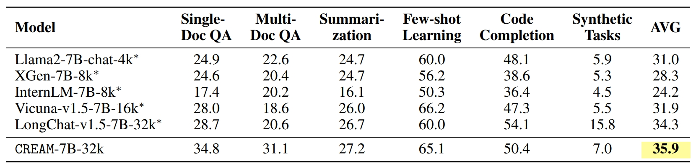
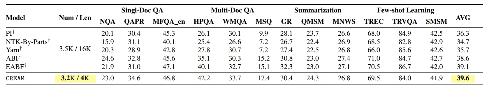

<div align="center">


# An Efficient Recipe for Long Context Extension via Middle-Focused Positional Encoding

[](https://arxiv.org/abs/2406.07138)
[](https://nips.cc/Conferences/2024)

</div>

## Updates

- (2024.09.26) Our Paper have been accepted by **NeurIPS 2024**🔥🔥.
- (2024.06.11) Paper Release on [Arxiv](https://arxiv.org/pdf/2406.07138).

## 🚀 Overview

We propose **C**ontinuity-**R**elativity ind**E**xing with g**A**ussian **M**iddle (**CREAM**), which interpolates positional encodings by manipulating position indices. 

Apart from being simple, CREAM is training-efficient: it only requires fine-tuning at the pre-trained context window (e.g., Llama 2-4K) and can extend LLMs to a much longer target context length (e.g., 256K). 

To ensure that the model focuses more on the information in the middle, we introduce a truncated Gaussian to encourage sampling from the middle part of the context during fine-tuning, thus alleviating the “Lost-in-the-Middle” problem faced by long-context LLMs. 

Experimental results show that CREAM successfully extends LLMs to the target length for both Base and Chat versions of Llama2-7B with “Never Miss A Beat”.



## ⚙️ Installation

```bash
# clone project
git clone git@github.com:wutong4012/CREAM.git
cd CREAM

# create conda environment
conda create -n cream python=3.9
conda activate cream

# install requirements
pip install -r requirements.txt
conda install -c nvidia cuda-nvcc
pip install flash_attn-2.5.7+cu122torch2.2cxx11abiFALSE-cp39-cp39-linux_x86_64.whl

# replace lm-evaluation-harness
git clone https://github.com/EleutherAI/lm-evaluation-harness.git
"replace lm_eval folder"

```

## 💡 How to run

You can download all the finetune data and evaluation data from [pile_4k_train](https://huggingface.co/datasets/victor-wu/pile_4k_train), [pile_val](https://huggingface.co/datasets/victor-wu/pile_val), [ShareGPT_4k_train](https://huggingface.co/datasets/victor-wu/ShareGPT_4k_train), [ShareGPT_val](https://huggingface.co/datasets/victor-wu/ShareGPT_val), [gov_report](https://huggingface.co/datasets/victor-wu/gov_report), [proof-pile](https://huggingface.co/datasets/victor-wu/proof-pile), [book3](https://huggingface.co/datasets/victor-wu/book3), [pg19_long](https://huggingface.co/datasets/victor-wu/pg19_long), [LongChat-Lines](https://huggingface.co/datasets/victor-wu/LongChat-Lines), [Needle in a Haystack](https://github.com/gkamradt/LLMTest_NeedleInAHaystack), [LongBench](https://github.com/THUDM/LongBench)

**Attention: You have to modify the "root" path in every file in the *scripts* folder.**

Train model

```bash
bash scripts/run_CREAM.sh 8 linear llama2 5946 CREAM

bash scripts/run_CREAM_chat.sh 8 linear llama2_chat 5946 CREAM
```

Evaluate model

```bash
bash scripts/eval_longchat_lines.sh 8 linear llama2 CREAM 1000

bash scripts/eval_lost_in_the_middle.sh 8 linear llama2 CREAM 1000

bash scripts/eval_needle.sh 8 linear llama2_chat CREAM 100

bash scripts/eval_longbench.sh 8 linear llama2_chat CREAM 100

bash scripts/eval_ppl.sh 8 linear llama2 CREAM 1000

bash scripts/eval_long_ppl.sh 64 linear llama2 CREAM 1000

bash scripts/eval_benchmark.sh 8 linear llama2 CREAM 1000
```

## ⚽ Evaluation Results

***LongChat-Lines***



***Lost in the Middle***



***Needle in a Haystack***



***LongBench***




## Acknowledgement

Data / Code: 
- [PoSE](https://github.com/dwzhu-pku/PoSE)
- [LongChat-Lines](https://github.com/abacusai/Long-Context/tree/main/python/eval/longeval) 
- [Lost in the Middle](https://github.com/nelson-liu/lost-in-the-middle)
- [Needle in a Haystack](https://github.com/gkamradt/LLMTest_NeedleInAHaystack)
- [LongBench](https://github.com/THUDM/LongBench)
- [lm evaluation harness](https://github.com/EleutherAI/lm-evaluation-harness)

## 📜 Citation

Please cite our paper if you use [CREAM](https://arxiv.org/abs/2305.09515) in your work:

```bibtex
@misc{wu2024cream,
      title={Never Miss A Beat: An Efficient Recipe for Context Window Extension of Large Language Models with Consistent "Middle" Enhancement}, 
      author={Tong Wu and Yanpeng Zhao and Zilong Zheng},
      year={2024},
      eprint={2406.07138},
      archivePrefix={arXiv},
      primaryClass={cs.CL},
      url={https://arxiv.org/abs/2406.07138}, 
}
```
